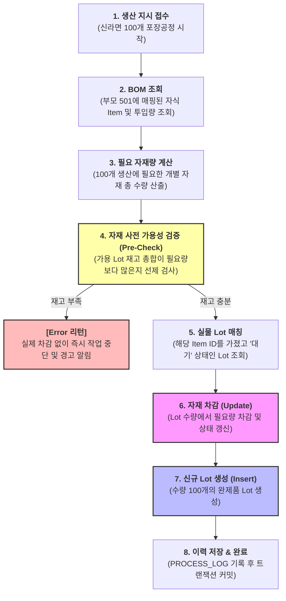

# Step 5: 생산 가동 및 실시간 Lot 추적 (step5_run.md)

공장을 기동하여 **"신라면 완제품 100개"**를 생산하는 가상 테스트를 진행하며, 시스템 내부에서 어떤 흐름으로 BOM을 조회하고 실물 Lot을 찾아내어 연산하는지 검증합니다.

---

## ⚙️ 1. 생산 가동 (Run) API 내부 동작 시퀀스

작업자가 생산 시작 신호를 보냈을 때 백엔드 프로그램이 수행하는 내부 단계입니다. 특히 자재 부족으로 인한 불필요한 롤백 부하를 막기 위해 **자재 사전 가용성 검증(Pre-Check)** 단계를 포함합니다.

---

## 🚀 2. 실제 데이터 매핑 및 연산 시나리오

초기 입고된 Lot 정보([Step 4 참고](file:///f:/ProjectGit/MESSample/senario/step4_lot.md))를 바탕으로 **"신라면 완제품 100개(최종 포장 공정)"** 가동을 진행한 결과 데이터 변화는 다음과 같습니다.

### ① BOM 기반 필요 자재 산출 결과
* 부모 품목: `501 (신라면 완제품)` ➡️ 지시 수량: `100 ea`
* **소요 자재 계산**:
  * `401 (신라면 면발)` 100 ea 필요
  * `201 (신라면 분말스프)` 100 ea 필요
  * `301 (신라면 포장비닐)` 100 ea 필요

### ② DB 연산 후의 실물 Lot 수량 변화 (차감 및 생성)

#### 1) 소모 자재 Lot (Update)
* **신라면 면발 Lot** (`LOT-NOODLE-100` / item_id: 401)
  * 차감 전: `100 ea` ➡️ **차감 후: `0 ea` (소진 완료 상태로 변경)**
* **신라면 분말스프 Lot** (`LOT-SNSOUP-001` / item_id: 201)
  * 차감 전: `500 ea` ➡️ **차감 후: `400 ea`**
* **신라면 포장비닐 Lot** (`LOT-SNVINYL-001` / item_id: 301)
  * 차감 전: `500 ea` ➡️ **차감 후: `400 ea`**

#### 2) 최종 완성품 Lot (Insert)
* **신라면 완제품 Lot** (`LOT-RAMEN-100` / item_id: 501)
  * **신규 생성**: 수량 `100 ea` / 구분: `제조품` / 상태: `검사대기` / 제조 시간 기록

---

## 💡 시나리오 검증 포인트

1. **자재 사전 가용성 검증 (Pre-Check)**:
   * 자재 하나라도 부족할 시, 다른 자재 차감 쿼리가 실행되기 전 선제적으로 가동을 중단하고 경고를 리턴하는지 검증합니다. (DB 부하 최적화)
2. **트랜잭션 ACID 보장**:
   * 만약 Pre-Check 이후 실제 차감 처리 도중 예기치 못한 원인으로 실패가 발생했을 때, 변경을 시도했던 모든 데이터가 이전 상태로 정상 원복(Rollback)되는지 검증합니다.
3. **재고 분할(Split) 차감**:
   * 만약 스프를 100개 차감해야 하는데 첫 번째 Lot에 40개만 남았을 경우, 첫 번째 Lot에서 40개를 전량 소모하고 다른 Lot을 찾아 60개를 추가로 차감하는 복수 Lot 차감 로직이 올바르게 구동되는지 테스트합니다.
