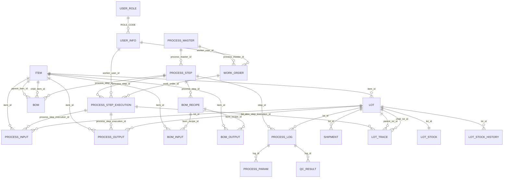

# DB 관계도

기준 파일: `src/WAS/Data/Scripts/Migrations`

이 문서는 WAS 마이그레이션 SQL 기준의 현재 DB 관계를 정리한 문서입니다.

## ERD

## 주요 테이블

| 구분 | 테이블 | 역할 |
|---|---|---|
| 인증/권한 | USER_ROLE | 역할 코드, 역할명, 권한 JSON |
| 인증/권한 | USER_INFO | 사용자 계정, 로그인 정보, 역할 |
| 기준정보 | ITEM | 품목 마스터 |
| 기준정보 | ITEM_TYPE | 품목 유형 마스터. 현재 FK 연결 없음 |
| 기준정보 | PROCESS_MASTER | 공정 흐름 마스터 |
| 기준정보 | PROCESS_STEP | 공정 단계. 공정 마스터와 설비 ID를 가짐 |
| BOM | BOM | 폐기. 기존 부모/자식 품목 BOM. 0033 이후에도 삭제되지 않음 |
| BOM | BOM_RECIPE | 정규화된 BOM 레시피 헤더 |
| BOM | BOM_INPUT | 레시피별 투입 품목 |
| BOM | BOM_OUTPUT | 레시피별 산출 품목 |
| 생산 | WORK_ORDER | 승인된 작업 지시 |
| 생산 | PROCESS_STEP_EXECUTION | 작업 지시의 단계별 실행 상태 |
| 생산 | PROCESS_INPUT | 실제 공정 투입 LOT/품목/수량 |
| 생산 | PROCESS_OUTPUT | 실제 공정 산출 LOT/품목/수량 |
| 재고/추적 | LOT | LOT 기본 정보 |
| 재고/추적 | LOT_STOCK | LOT별 현재 재고 스냅샷 |
| 재고/추적 | LOT_STOCK_HISTORY | LOT 재고 변경 이력 |
| 재고/추적 | LOT_TRACE | 부모 LOT와 자식 LOT의 계보 추적 |
| 이력/검사 | PROCESS_LOG | 초기 공정 처리 이력 |
| 이력/검사 | PROCESS_PARAM | 공정 로그별 파라미터 |
| 이력/검사 | QC_RESULT | 공정 로그별 검사 결과 |
| 이력/검사 | SHIPMENT | LOT 출하 기록 |
| 테스트 | TEST_USERS | 0001 테스트 테이블. 업무 FK 연결 없음 |

## 관계 요약

| From | To | FK 컬럼 | 비고 |
|---|---|---|---|
| USER_INFO | USER_ROLE | ROLE_CODE | 사용자 역할 |
| LOT | ITEM | item_id | LOT의 품목 |
| BOM | ITEM | parent_item_id | 폐기된 기존 BOM의 부모 품목 |
| BOM | ITEM | child_item_id | 폐기된 기존 BOM의 자식 품목 |
| BOM | PROCESS_STEP | process_step_id | 폐기된 기존 BOM의 적용 공정 단계 |
| PROCESS_STEP | PROCESS_MASTER | process_master_id | 공정 단계가 속한 공정 마스터. 삭제 시 NULL |
| WORK_ORDER | PROCESS_MASTER | process_master_id | 작업 지시 대상 공정 |
| WORK_ORDER | USER_INFO | worker_user_id | 작업자. NULL 허용 |
| PROCESS_STEP_EXECUTION | WORK_ORDER | work_order_id | 작업 지시별 단계 실행 |
| PROCESS_STEP_EXECUTION | PROCESS_STEP | process_step_id | 실행 대상 공정 단계 |
| PROCESS_STEP_EXECUTION | USER_INFO | worker_user_id | 단계 작업자. NULL 허용 |
| PROCESS_INPUT | PROCESS_STEP_EXECUTION | process_step_execution_id | 실행 단계의 투입 |
| PROCESS_INPUT | LOT | lot_id | 투입 LOT |
| PROCESS_INPUT | ITEM | item_id | 투입 품목 |
| PROCESS_OUTPUT | PROCESS_STEP_EXECUTION | process_step_execution_id | 실행 단계의 산출 |
| PROCESS_OUTPUT | LOT | lot_id | 산출 LOT |
| PROCESS_OUTPUT | ITEM | item_id | 산출 품목 |
| LOT_STOCK | LOT | lot_id | LOT별 1개만 허용 |
| LOT_STOCK_HISTORY | LOT | lot_id | LOT 재고 변경 이력 |
| LOT_TRACE | LOT | parent_lot_id | 부모 LOT. NULL 허용 |
| LOT_TRACE | LOT | child_lot_id | 자식 LOT |
| LOT_TRACE | PROCESS_STEP_EXECUTION | process_step_execution_id | LOT 생성/소비가 발생한 실행 단계. NULL 허용 |
| BOM_RECIPE | PROCESS_STEP | process_step_id | 레시피 적용 공정 단계. NULL 허용 |
| BOM_INPUT | BOM_RECIPE | bom_recipe_id | 레시피 투입 항목 |
| BOM_INPUT | ITEM | item_id | 투입 품목 |
| BOM_OUTPUT | BOM_RECIPE | bom_recipe_id | 레시피 산출 항목 |
| BOM_OUTPUT | ITEM | item_id | 산출 품목 |
| PROCESS_LOG | LOT | lot_id | 초기 공정 이력의 LOT |
| PROCESS_LOG | PROCESS_STEP | step_id | 초기 공정 이력의 단계 |
| PROCESS_PARAM | PROCESS_LOG | log_id | 공정 이력별 파라미터 |
| QC_RESULT | PROCESS_LOG | log_id | 공정 이력별 검사 결과 |
| SHIPMENT | LOT | lot_id | 출하 LOT |

## 제약 조건 메모

- `BOM`은 폐기된 기존 테이블이며, `parent_item_id`, `child_item_id`, `process_step_id` 조합이 유니크입니다.
- `BOM_RECIPE`는 `recipe_code`가 유니크입니다.
- `BOM_INPUT`은 `bom_recipe_id`, `item_id` 조합이 유니크입니다.
- `BOM_OUTPUT`은 `bom_recipe_id`, `item_id` 조합이 유니크입니다.
- `LOT_STOCK`은 `lot_id`가 유니크라 LOT당 현재 재고 행이 1개입니다.
- `WORK_ORDER.work_order_no`, `ITEM.item_code`, `PROCESS_MASTER.process_code`는 각각 유니크입니다.
- `PROCESS_STEP_EXECUTION.status`는 최종 마이그레이션 기준 `WAITING`, `RUNNING`, `PAUSED`, `DONE`, `FAILED`, `DELETED`, `COMPLETED`를 허용합니다.
